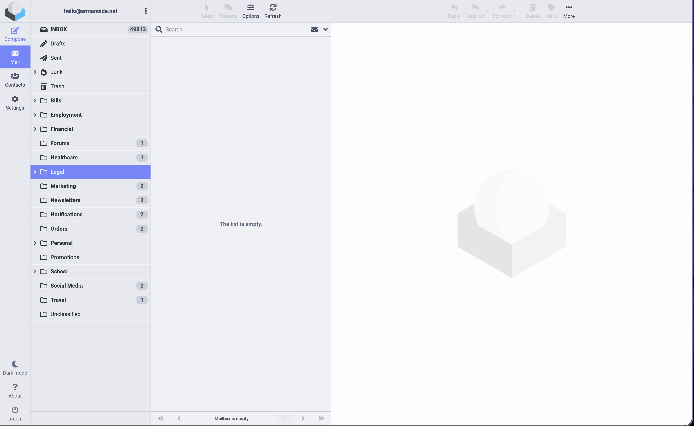
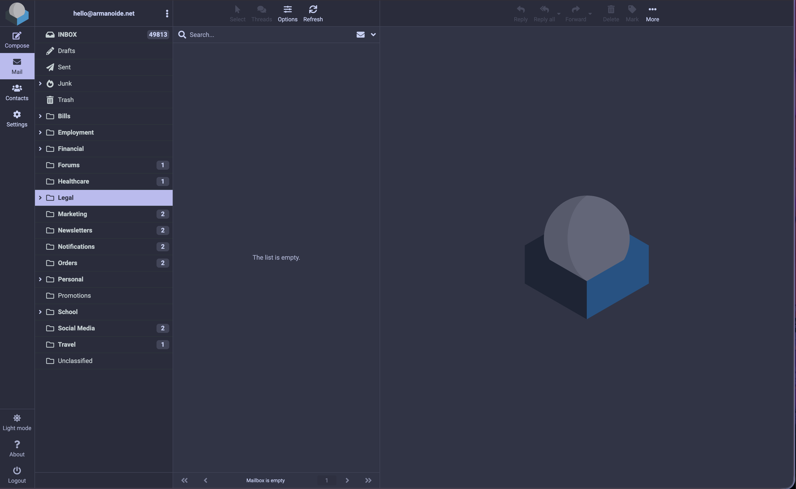
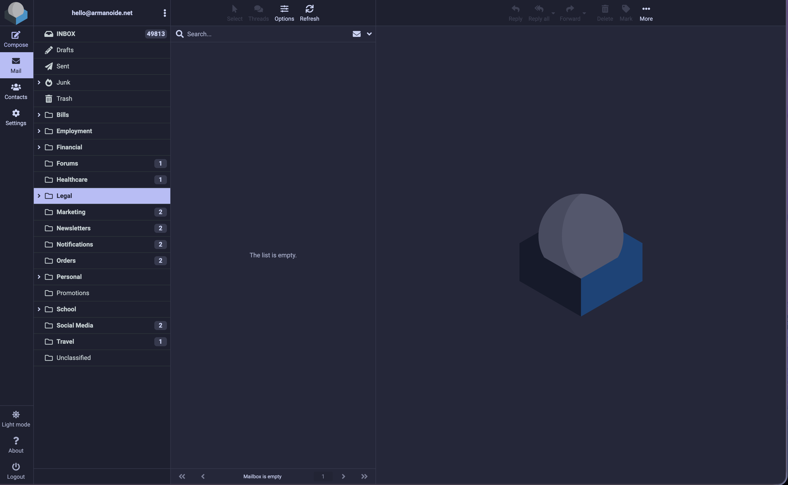
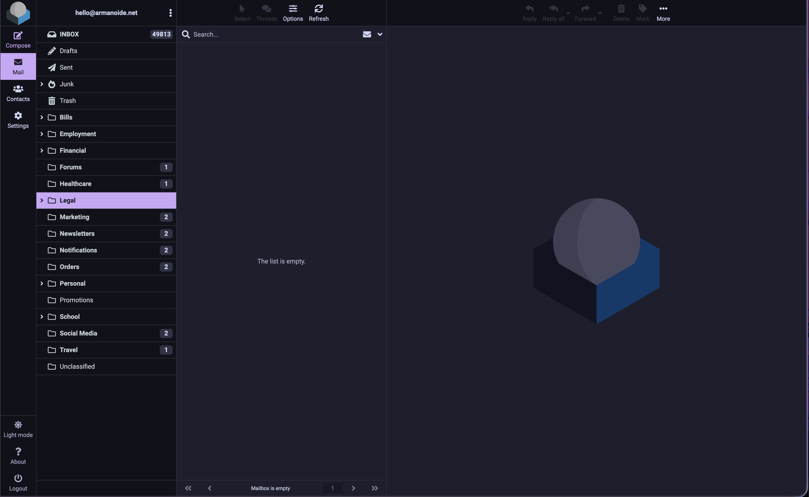
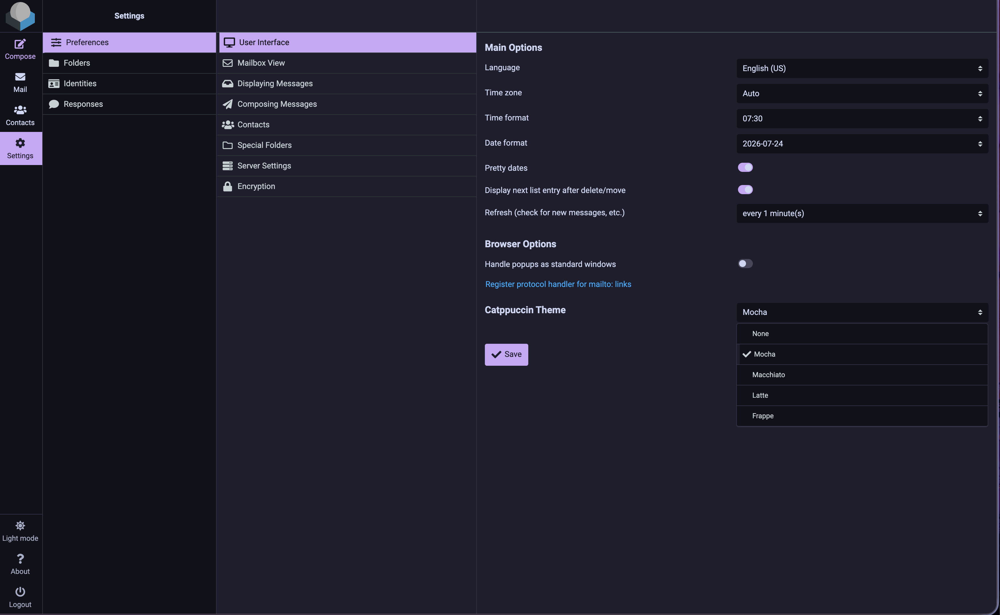

<h3 align="center">
    <br/>
    
    Catppuccin for <a href="https://roundcube.net">Roundcube</a>
    
</h3>

<p align="center">
    <a href="https://github.com/Armanoide/roundcube_catppuccin/stargazers">
        
    </a>
    <a href="https://github.com/Armanoide/roundcube_catppuccin/issues">
        
    </a>
    <a href="https://github.com/Armanoide/roundcube_catppuccin/forks">
        
    </a>
</p>

<p align="center">
    
</p>

<p align="center">
    <sup>Soothing pastel Catppuccin flavours for Roundcube's Elastic skin <3</sup>
    <br/>
    <sub>⭐️ <a href="https://github.com/Armanoide/roundcube_catppuccin">GitHub</a>
    · 📖 <a href="https://roundcube.net">Roundcube</a></sub>
</p>

## Previews

<details>
<summary>🌻 Latte</summary>

</details>
<details>
<summary>🪴 Frappé</summary>

</details>
<details>
<summary>🌺 Macchiato</summary>

</details>
<details>
<summary>🌿 Mocha</summary>

</details>

&nbsp;

## 🧠 Installation

### Composer (recommended)

```bash
cd /path/to/roundcube
composer require armanoide/roundcube-catppuccin
```

### Manual

```bash
git clone https://github.com/Armanoide/roundcube_catppuccin.git \
    /path/to/roundcube/plugins/roundcube_catppuccin
```

Then enable it in `config/config.inc.php`:

```php
$config['plugins'][] = 'roundcube_catppuccin';
```

### Docker

```yaml
services:
  roundcubemail:
    image: roundcube/roundcubemail:latest
    environment:
      - ROUNDCUBEMAIL_SKIN=elastic
      - ROUNDCUBEMAIL_PLUGINS=archive,zipdownload,roundcube_catppuccin
    volumes:
      - ./www/config:/var/www/html/config
      - ./www/plugins:/var/www/html/plugins
```

&nbsp;

## 🍱 Usage

Once installed and enabled, users can pick their flavour directly from the UI:

**Settings &gt; General &gt; Catppuccin Theme**

The selection is persisted to the database and synced to a cookie so the
login page reflects it before authentication.



## ⚙️ Configuration

### Global default flavour (optional)

Set a default flavour for all users in `config/config.inc.php`:

```php
$config['catppuccin_flavor'] = 'mocha';
```

### Lock the setting (optional)

Prevent users from changing their flavour:

```php
$config['dont_override'][] = 'catppuccin_flavor';
```

### Watermark page (optional)

Display a themed blank page (e.g. for login portal or branding):

```php
$config['blankpage_url'] = 'https://your-webmail-host/static.php/plugins/roundcube_catppuccin/watermark.html';
```

The watermark respects the user's selected flavour via cookie, so the
background colour matches automatically.

&nbsp;

## 📋 Requirements

- **Roundcube** 1.6+
- **PHP** 8.0+
- **Elastic skin** (default in Roundcube)

&nbsp;

## 💝 Thanks To

- **[Catppuccin Org](https://github.com/catppuccin)** — for the beautiful palettes

&nbsp;

<p align="center"></p>
<p align="center">Copyright &copy; 2021-present <a href="https://github.com/catppuccin" target="_blank">Catppuccin Org</a>
<p align="center"><a href="https://github.com/catppuccin/catppuccin/blob/main/LICENSE"></a></p>
